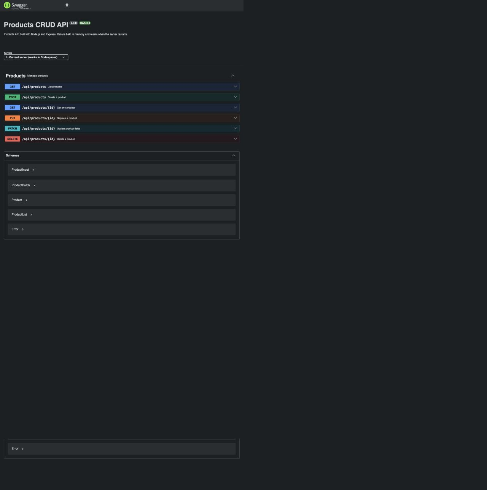
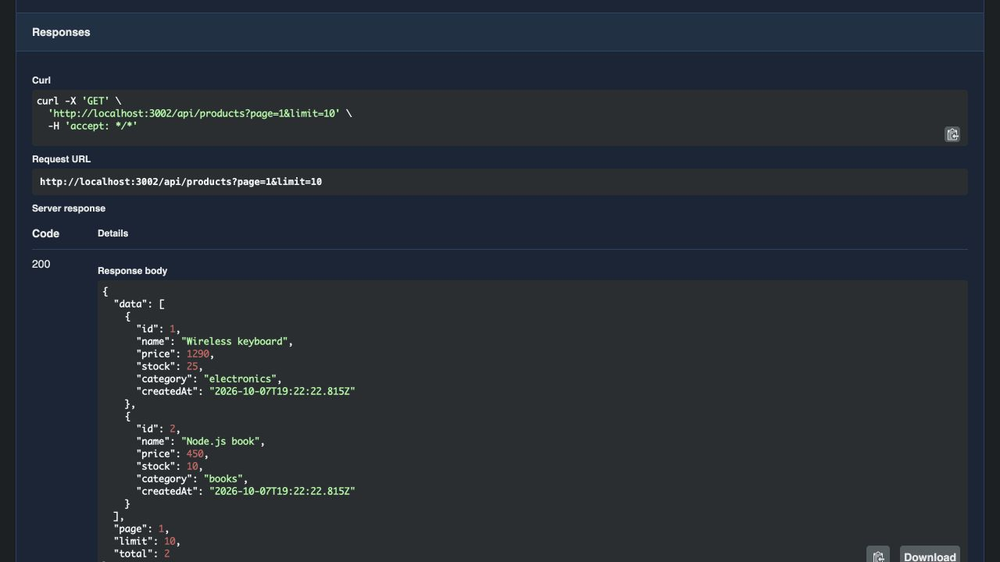
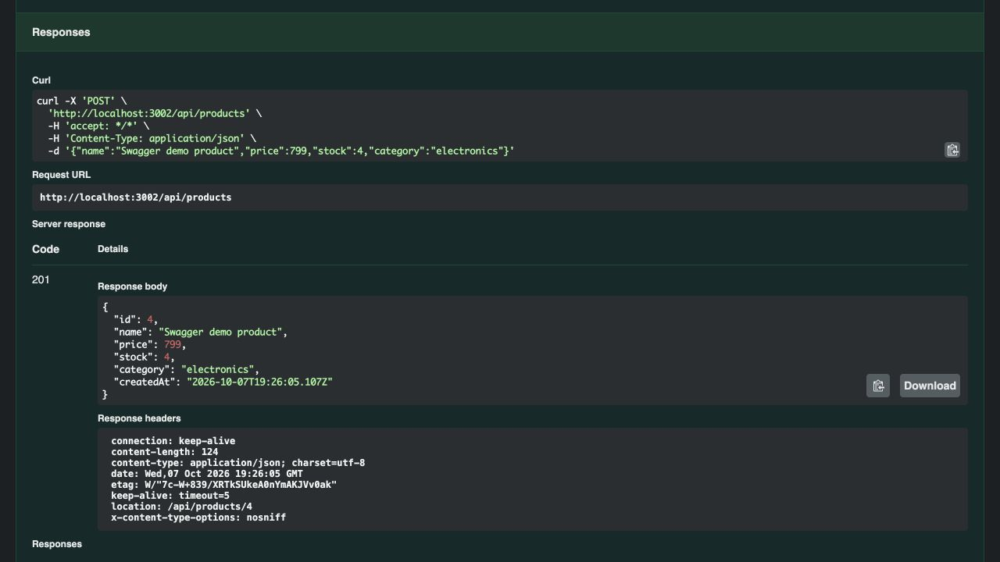
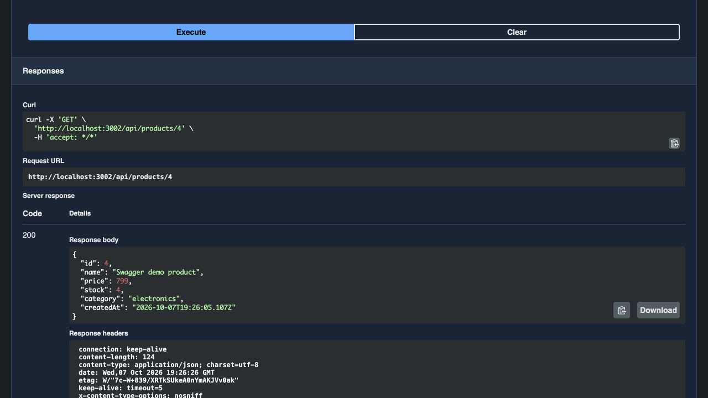
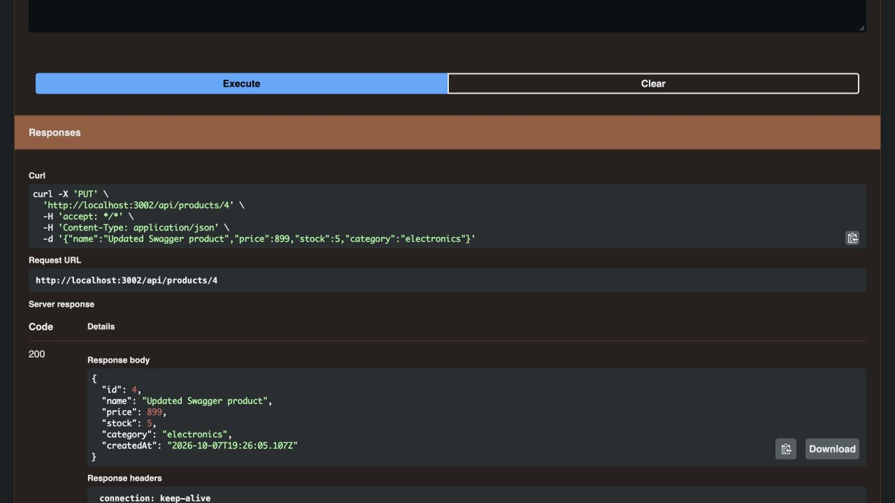
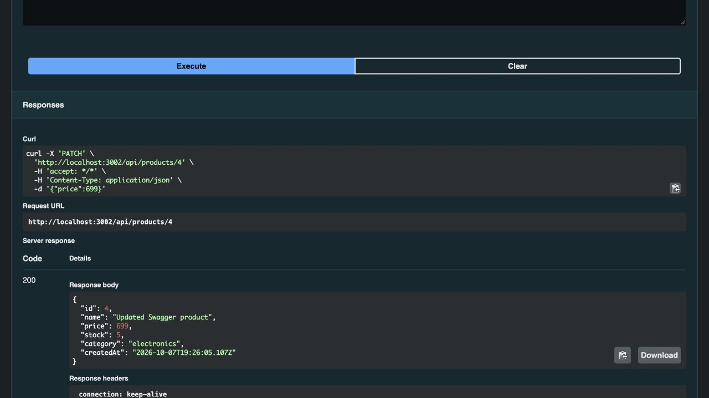
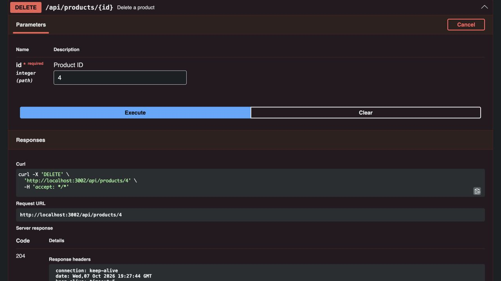

# งานข้อ 2: Products CRUD + Swagger UI

**ใส่ลิงก์ตรงนี้:** https://github.com/Akirakato112233/file-upload-api

Repository เป็น **Public**; โปรเจกต์เวอร์ชัน **2.0.0** มี Node.js + Express Products CRUD API
พร้อม OpenAPI 3.0.3 และ Swagger UI ที่ `/api-docs`

ทดสอบ Swagger UI และทุก endpoint ด้วย **Try it out → Execute** แล้ว ภาพชุดนี้ถ่ายจากเซิร์ฟเวอร์ในเครื่องที่ `http://localhost:3002`; ผล `curl` ทั้ง 6 endpoint อยู่ใน [local-curl-output.txt](evidence/products/local-curl-output.txt)
Codespace ต้องติดตั้ง dependencies (`npm ci`) และรัน `npm start` เพื่อเปิด `/api-docs` ที่พอร์ต 3000

## หน้าแรก Swagger UI

## GET /api/products — 200 OK

## POST /api/products — 201 Created

## GET /api/products/{id} — 200 OK

## PUT /api/products/{id} — 200 OK

## PATCH /api/products/{id} — 200 OK

## DELETE /api/products/{id} — 204 No Content

