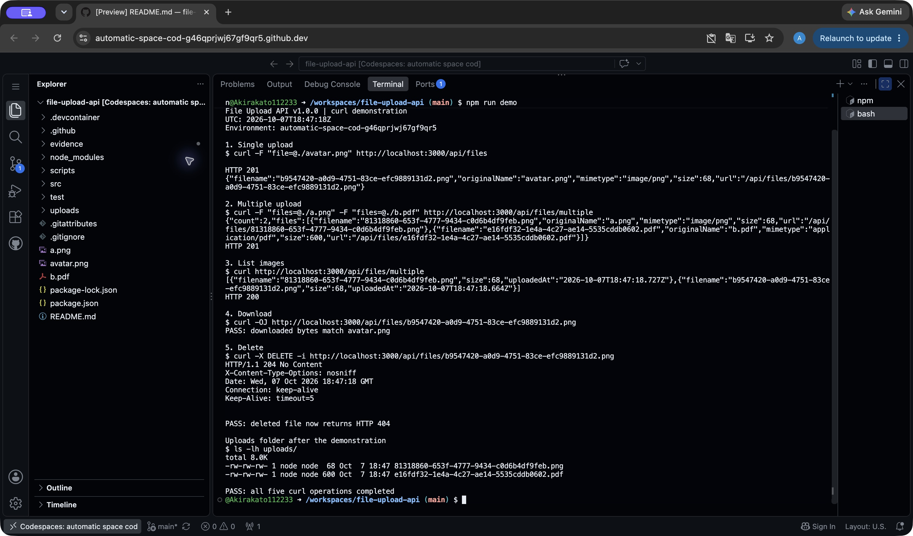
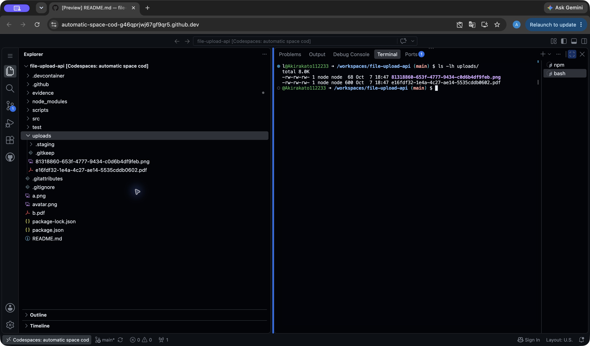

# หลักฐานการทดสอบบน GitHub Codespaces

- Repository public: https://github.com/Akirakato112233/file-upload-api
- เวอร์ชัน API: **1.0.0**
- Codespace: `automatic-space-cod-g46qprjwj67gf9qr5`
- วันที่ทดสอบ: **8 ตุลาคม 2026 เวลา 01:47 น. ประเทศไทย** (7 ตุลาคม 2026 เวลา 18:47 UTC)
- API ที่ทดสอบ: `http://localhost:3000`
- ผลลัพธ์ข้อความจริง: [terminal-output.txt](terminal-output.txt)

| ข้อ | การทดสอบ | ผล |
| --- | --- | --- |
| 1 | อัปโหลด avatar.png | HTTP 201 |
| 2 | อัปโหลด a.png และ b.pdf | HTTP 201, count 2 |
| 3 | รายการรูปภาพ | HTTP 200, มี PNG สองไฟล์และไม่มี PDF |
| 4 | ดาวน์โหลด | ไบต์ตรงกับ avatar.png โดยตรวจด้วย cmp |
| 5 | ลบ | HTTP 204 และดาวน์โหลดซ้ำได้ 404 |

Integration tests บน Codespaces: **ผ่าน 9/9 กรณี**

## ภาพคำสั่งและผลลัพธ์ทั้ง 5 ข้อ

ภาพหน้าจอจริงจาก Codespaces Terminal หลังรัน `npm run demo`
สคริปต์เรียก `curl` ทั้ง 5 ข้อ แสดงคำสั่งที่ใช้ และบันทึกผลลงไฟล์ข้อความ

## ภาพโฟลเดอร์ uploads

หลังลบไฟล์จากข้อ 1 แล้ว จะเหลือ PNG และ PDF ที่อัปโหลดในข้อ 2
ภาพแสดงทั้ง Explorer และผล `ls -lh uploads/` ภายใน Codespace เดียวกัน

ไฟล์ที่อัปโหลดจริงอยู่ใน Codespace และถูก ignore จาก Git ตามการออกแบบ
ส่วนภาพหน้าจอและผลการทดสอบถูก commit เพื่อเปิดดูหลักฐานได้แม้ Codespace หยุดทำงาน
